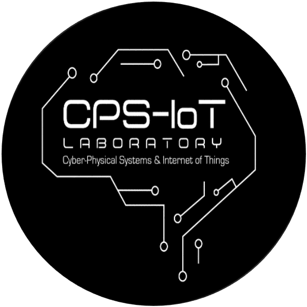

# ¡Hola! My name is Homar. The "H" is silent :)

  <a href="https://www.linkedin.com/in/homar-rodriguez-ramos/">
    

## 🇵🇷 About Me
I am a graduate student in Electrical and Computer Engineering at Johns Hopkins University. Currently, I work with the IEEE MOVE Puerto Rico Program on natural disaster emergency response.

## 🏫 Education
* M.Sci Electrical and Computer Engineer - Johns Hopkins University (INPROGRESS)
* B.Sci. Computer Engineer - University of Puerto Rico - Mayagüez (2024)

## 🔨 Research Interest
* Digital Systems
* Communication Systems
* Analog Electronics
* Hardware Security
* Engineering Education

## 📚 Research Experience

| Project                                                                                 | Research Lab                                                         |
|-----------------------------------------------------------------------------------------|----------------------------------------------------------------------|
| Security Strategies for an Image Stitching Embedded Platform                            |                  |
| Study of 4K Image Stitching Strategies for Efficient Embedded Implementation            |                  |
| Raytheon Intelligence & Space Research: Project OWL – Red Cross Safe & Well Integration |                 |
| Team LiDron’s LiDAR Based Autonomous Landing System for UAVs                            |                 |
| Design of Autonomous Vehicles and Innovation in Transportation                          |   |

## 📰 Professional Organizations
* IEEE MOVE Global - Puerto Rico
* IEEE Western Puerto Rico Section
* IEEE Young Professional
* IEEE Computer Society
* IEEE Electromagnetic Compatibility Society
* IEEE Signal Processing Society

## 🛠️ Tech Stack
**Programming**

**Operating Systems**

